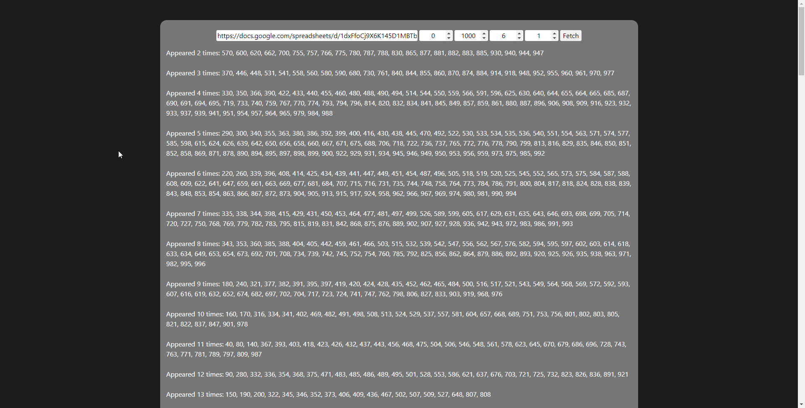

# Spreadsheet Finds Unique

Find the unique number in specific sheet, specific column.

### Google API Key is required
```
1. Visit https://console.cloud.google.com/apis/dashboard
2. Create new app
3. Enable Google Sheet API
4. Create API Key and add it to .env file (duplicate the .env.prod)
```

```
npm run build
npm start
```

## Preview
